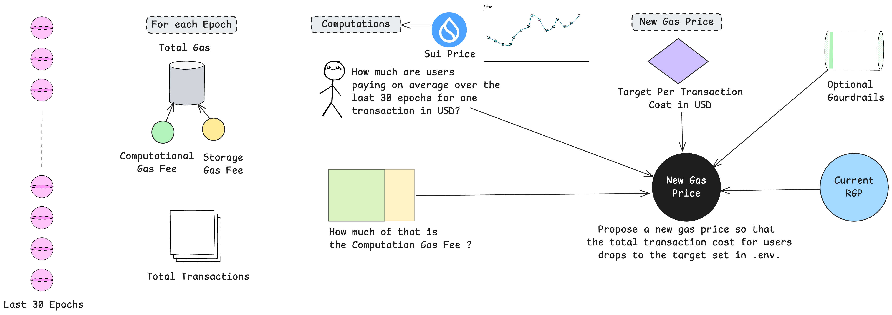

# Sui RGP Autopilot
This repo helps a Sui validator compute and publish a sensible **Reference Gas Price (RGP)** automatically.

## Logic


## Explanation

- **Look back over recent epochs**
    - For each epoch we fetch:
        - Gas breakdown from `rollingGasSummary` (computation, storage cost, storage rebate)
        - `totalTransactions`

- **Convert to “what users actually paid”**
    - For each epoch:  
      `total gas paid = computation + storage cost − storage rebate`
    - Compute **per-transaction** averages
    - Compute **what fraction was computation** vs storage

- **Add USD context**
    - Map each epoch’s date to the daily **SUI → USD** price
    - Express per-tx total and computation **in USD**

- **You set the policy target**
    - In `.env` choose the target **average total cost per transaction (USD)** you want users to experience (e.g., `0.0040`)

- **Size a new RGP quote**
    - Use the recent **computation share** and **computation USD per tx**
    - Scale today’s **current RGP** up or down so the computation portion steers the overall user cost toward your target  
      *(RGP directly influences the computation part; storage is mostly independent.)*

- **Apply safety & ergonomics**
    - **Guard-rails**: don’t change too far from the current RGP (e.g., −40% / +40%)
    - **Rounding**: snap to a clean step (e.g., 1 or 10 MIST)
    - **Tiny jitter**: add a few MIST so many validators don’t collide on the exact same number

- **When to submit**
    - Default policy: **submit right after a new epoch starts** so your quote is cleanly included in the next survey (affects E+2) and avoids boundary race conditions

- **What we intentionally ignore**
    - **Stake subsidy & similar effects** are small (≈1–2%) compared to gas, so they’re not used to size the quote. The focus is matching user cost.

- **Output**
    - A single proposed **RGP in MIST**, plus the supporting metrics so you can see how we arrived at it
---

## Quick start

### Requirements
- Node.js 18+
- Public Sui GraphQL endpoint (defaults to mainnet if unset)
- (Optional) Prometheus Pushgateway for monitoring

### Install
```bash
git clone https://github.com/encapsulate-xyz/sui-rgp-autopilot.git
cd sui-rgp-autopilot
npm install
```
### Configure .env 
```bash
# Required — policy target (USD per tx)
TARGET_AVG_TX_USD=
MAINNET_OPERATION_PRIVATE_KEY=
MAINNET_OPERATION_CAP_ID=
```
Leave the rest to defaults for a quick start

### Submit Gas Price Immediately
```bash
CRON_ENABLED=false node mainnet.js
```

### Schedule Gas Price Submissions
```bash
node mainnet.js
```
or
```bash
npm run start
```
